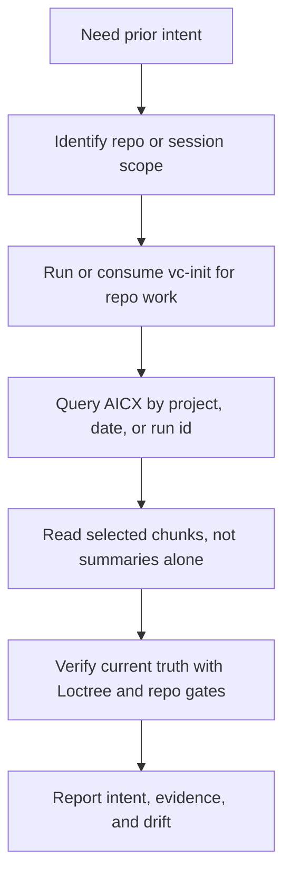

# `vc-aicx` Flow

## Flow

## Routes

| Entry          | Args                         | Produces                          | Exit              |
| -------------- | ---------------------------- | --------------------------------- | ----------------- |
| `aicx search`  | query + project/date filters | ranked session chunks             | evidence list     |
| `aicx intents` | project scope                | structured intent/outcome records | intent map        |
| `aicx extract` | raw JSON/JSONL/task output   | readable markdown                 | recovered context |
