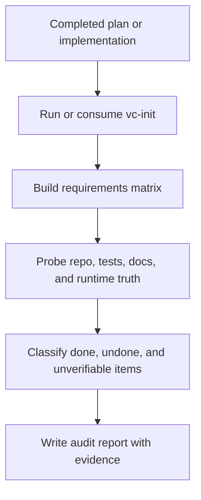

# `vc-audit` Flow

## Flow

## Routes

| Entry                       | Args                   | Produces     | Exit                 |
| --------------------------- | ---------------------- | ------------ | -------------------- |
| `vibecrafted audit <agent>` | `--prompt` or `--file` | audit report | P0/P1/P2/P3 findings |
| `vc-audit <agent>`          | same                   | same         | same                 |
