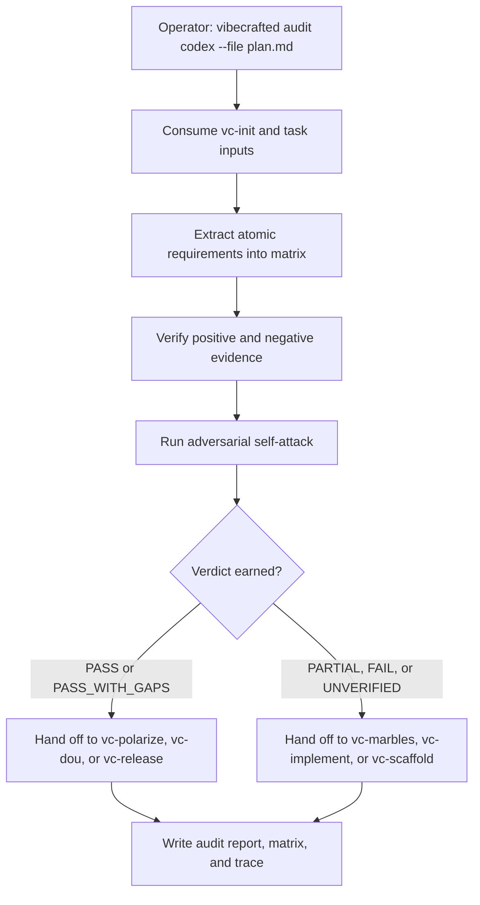

# `vc-audit` Flow

## Flow

## Routes

| Entry                       | Args                   | Produces                                               | Exit            |
| --------------------------- | ---------------------- | ------------------------------------------------------ | --------------- |
| `vibecrafted audit <agent>` | `--prompt` or `--file` | audit report, requirements matrix, trace, and metadata | `0` on dispatch |
| `vc-audit <agent>`          | same                   | same                                                   | `0` on dispatch |
| `vc-verify <agent>`         | same                   | same                                                   | `0` on dispatch |

### Escalation edges

- PASS / PASS_WITH_GAPS needs product-surface readiness -> `vibecrafted dou <agent>`
- PASS / PASS_WITH_GAPS needs final release mechanics -> `vibecrafted release <agent>`
- PARTIAL / UNVERIFIED gaps need convergence -> `vibecrafted marbles <agent>`
- FAIL means the spec or implementation shape is wrong -> `vibecrafted scaffold <agent>`

### Session artifacts

- Artifact root: `$VIBECRAFTED_HOME/artifacts/<org>/<repo>/<YYYY_MMDD>/`
- Lock: `$VIBECRAFTED_HOME/locks/<org>/<repo>/<run_id>.lock`
- Outputs: `reports/audit_report.md`, `reports/audit_requirements_matrix.jsonl`, and `reports/audit_trace.log`
