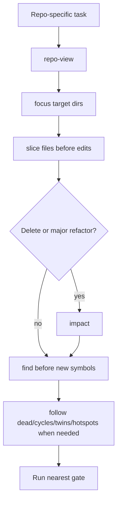

# `vc-loctree` Flow

## Flow

## Routes

| Entry            | Args         | Produces                   | Exit         |
| ---------------- | ------------ | -------------------------- | ------------ |
| `loct repo-view` | project root | repo overview              | map          |
| `loct focus`     | directory    | module overview            | target map   |
| `loct slice`     | file         | dependencies and consumers | edit context |
