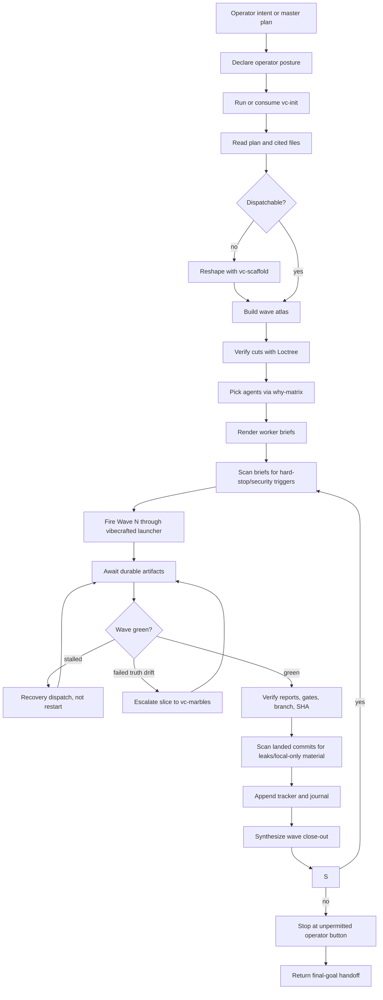

# `vc-operator` Flow

`vc-operator` is the autonomous orchestration posture for a planned
multi-wave dispatch chain.

It conducts. It does not become the worker.

## Core Loop

## Phase Contract

| Phase            | Question                                              | Required output                 |
| ---------------- | ----------------------------------------------------- | ------------------------------- |
| Posture          | Did we explicitly enter operator mode?                | one-line framing shift          |
| Orientation      | Do we have current repo/runtime/intention truth?      | `vc-init` evidence              |
| Plan intake      | Is the full plan and every cited file read?           | input coverage note             |
| Dispatchability  | Can the plan be run as waves?                         | wave atlas or scaffold handoff  |
| Cut verification | Does each cut match repo structure?                   | Loctree annotations             |
| Agent choice     | Who should run each slice?                            | why-matrix rationale            |
| Briefing         | Can a worker execute without guessing?                | rendered dispatch brief         |
| Brief scan       | Does the prompt contain hard-stop/security triggers?  | scan note or refusal            |
| Dispatch         | Did every spawn go through framework telemetry?       | run IDs and launch cards        |
| Await            | Did each worker finish, stall, or fail with evidence? | report/transcript/meta state    |
| Recovery         | Is the next action focused, not a blind retry?        | recovery brief or escalation    |
| Commit scan      | Did worker commits leak local-only or sensitive data? | scan note or sanitized recommit |
| Close-out        | What landed and where?                                | wave report, SHAs, gates        |
| Stop             | What remains unpermitted/operator-owned?              | final-goal handoff              |

## Operator Journal

Operator mode keeps two living artifacts:

- `tracker.md` - wave status, checkbox state, run IDs, branches, SHAs, gates.
- `journal.md` - append-only mission diary for decisions, stalls, recoveries,
  framing shifts, and stop points.

The tracker lets the operator audit what landed without reading every report.
The journal explains why the wave moved the way it did.
Plan mutations and security guardrail incidents are journal entries, not
memory-only explanations.

## Routes

| Entry                          | Args                   | Produces                                              | Exit        |
| ------------------------------ | ---------------------- | ----------------------------------------------------- | ----------- |
| `vibecrafted operator <agent>` | `--prompt` or `--file` | tracker, journal, wave close-outs, stop-point handoff | `0` on stop |
| `vc-operator <agent>`          | same                   | same                                                  | `0` on stop |
| `vc-conductor <agent>`         | same                   | same                                                  | `0` on stop |

### Escalation edges

- Need a plan first -> `vibecrafted scaffold <agent>`
- Need shared strategy before dispatch -> `vibecrafted partner <agent>`
- A slice needs solo A to Z delivery -> `vibecrafted ownership <agent>`
- Wave failed on truth drift -> `vibecrafted marbles <agent>`
- Completed chain needs release surface -> `vibecrafted release <agent>`

### Session artifacts

- Artifact root: `$VIBECRAFTED_HOME/artifacts/<org>/<repo>/<YYYY_MMDD>/operator/`
- Tracker: `<artifact-root>/tracker.md`
- Journal: `<artifact-root>/journal.md`
- Briefs: `<artifact-root>/briefs/*.md`
- Per-wave close-outs: `<artifact-root>/reports/<ts>_wave-<n>-close-out_operator.md`
- Final stop-point handoff: `<artifact-root>/reports/<ts>_stop-point_operator.md`
- Lock: `$VIBECRAFTED_HOME/locks/<org>/<repo>/<run_id>.lock`

## Anti-Patterns

- Acting like the implementer instead of the conductor.
- Re-firing a stalled wave without reading the failed worker report.
- Compressing wave status into "green" without SHAs and gate evidence.
- Treating native subagents as external fleet dispatches.
- Authoring worker achievements as operator achievements.
- Continuing past an unpermitted operator button.
