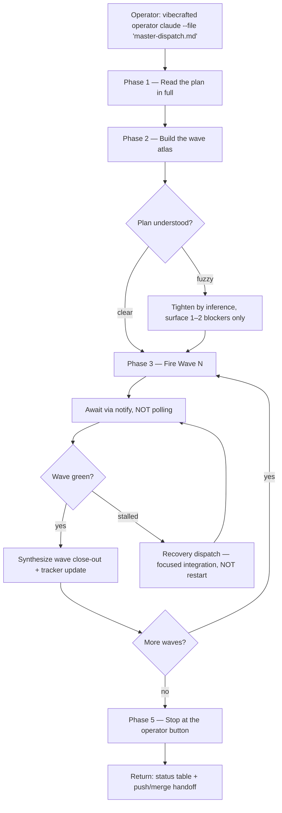

# `vc-operator` Flow

> The operator-facing flow for the Agent-Operator charter. Loaded alongside
> `SKILL.md` when the agent must conduct a multi-prompt dispatch chain.

## Flow



## Routes

| Entry                          | Args                   | Produces                                                  | Exit        |
| ------------------------------ | ---------------------- | --------------------------------------------------------- | ----------- |
| `vibecrafted operator <agent>` | `--prompt` or `--file` | wave-by-wave close-out reports + final stop-point handoff | `0` on stop |
| `vc-operator <agent>`          | same                   | same                                                      | `0` on stop |
| `vc-conductor <agent>`         | same (alias)           | same                                                      | `0` on stop |

### Escalation edges

- **Upstream — need a plan first**: hand off to `vibecrafted scaffold <agent>` to author the master dispatch. Resume operator mode once the plan exists.
- **Downstream — wave failed on truth-drift, not missing feature**: escalate the failing slice into `vibecrafted marbles <agent>` for convergence loop. Resume operator mode after marbles closes.
- **Sideways — need partner triage on architecture**: pause the wave, escalate to `vibecrafted partner <agent>` for shared executive reasoning. Return with sharpened plan.
- **Down to ground — wave produced runtime that needs A→Z polish**: hand the surface to `vibecrafted ownership <agent>` for solo-thread completion of the slice that operator mode prepared.

### Session artifacts

- Artifact root: `$VIBECRAFTED_HOME/artifacts/<org>/<repo>/<YYYY_MMDD>/operator/`
- Wave tracker: `<artifact-root>/tracker.md` (single living file; append-only per wave close-out)
- Per-wave close-outs: `<artifact-root>/reports/<ts>_wave-<n>-close-out_operator.md`
- Final stop-point handoff: `<artifact-root>/reports/<ts>_stop-point_operator.md`
- Lock: `$VIBECRAFTED_HOME/locks/<org>/<repo>/<run_id>.lock`

### Anti-patterns

- Re-firing a stalled wave without reading the failed worker's report → use recovery dispatch instead.
- Authoring close-out reports in your own `Authored-By:` line when workers did the work → AGENT FAIRNESS lives in _their_ commit attribution; your close-out is _operator narration_, not a commit.
- Compressing wave status into "yes everything green" without naming the SHAs → the tracker must let the operator audit specific commits without re-reading every worker report.
- Treating a Skill-tool subagent (native delegation) as equivalent to an external `/vc-agents` dispatch — the former runs inside your context window, the latter inside a separate worker. See `vc-delegate/SKILL.md` for the boundary.

---

## Call to Action

Read `SKILL.md` first, then `EMIL.md` for plan shape, then `DISPATCH.md` for
the worker dispatch body shape with rail-fenced kaomoji + suchar closing.
Fire Wave A. Schedule the heartbeat. Wait for `notify`.

---

## Closing Rail

```text
=======================
Flow is not a flowchart you draw and forget — it is the choreography you
honour wave after wave. The conductor's score is the plan; the conductor's
discipline is the rests between movements. (งಠ_ಠ)ง
=======================

Suchar: Why does the wave atlas never get lost? Because every checkbox
remembers which row it lives on. (._.)
```

---

_Vibecrafted. with AI Agents (c)2024–2026_
