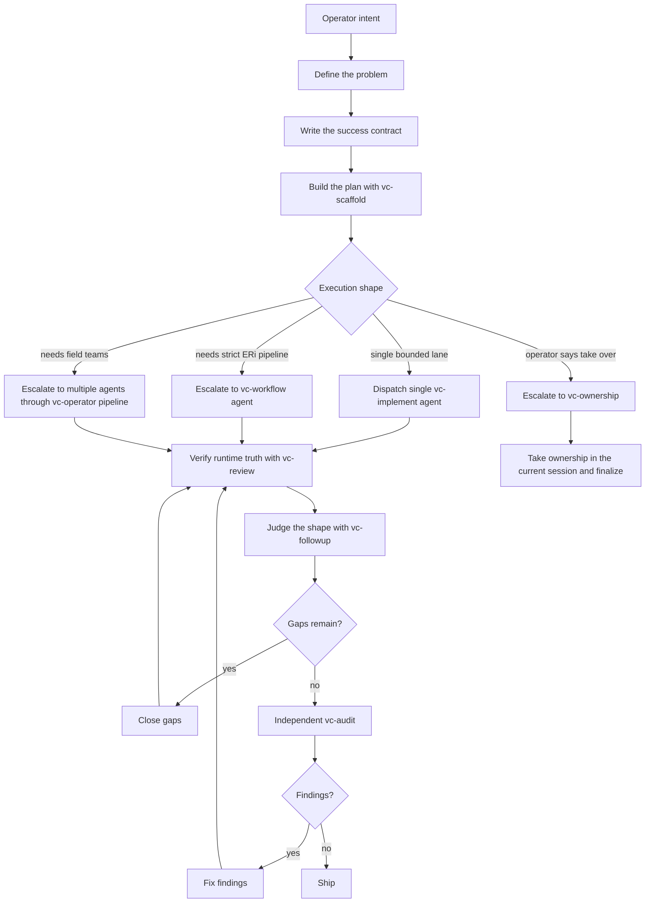

# `vc-partner` Flow

`vc-partner` is the collaborative delivery spine.

It is not a weaker `vc-ownership`. Ownership means "take the wheel and keep
driving." Partner means "we keep the steering brain shared while the agent does
the heavy work, gathers evidence, and turns decisions into shipped shape."

## Core Loop



## Phase Contract

| Phase             | Question                                         | Required output                                |
| ----------------- | ------------------------------------------------ | ---------------------------------------------- |
| Define            | What problem are we really solving?              | problem statement, scope, non-goals            |
| Success contract  | How will we know the shape is right?             | acceptance criteria, gates, runtime proof      |
| Plan              | What is the smallest credible execution path?    | ordered plan, checkpoints, escalation rule     |
| Execute           | Who does the work and where?                     | direct edits, workflow run, or delegated plans |
| Verify            | What is true in the live/runtime surface?        | gate logs, smoke results, observed behavior    |
| Shape review      | Did the result solve the original problem?       | match/mismatch notes, changed assumptions      |
| Gap closure       | What still prevents the promise from being true? | fixed gaps or explicit blocked boundary        |
| Independent audit | What would a fresh reviewer catch?               | audit report, severity-ranked findings         |
| Findings          | Which findings must be fixed before ship?        | fixes, deferrals with reasons, re-checks       |
| Ship              | Is this ready to hand off or publish?            | commit/report/release notes/next move          |

## Partner Depth

| Mode               | Use when                                                     | Shape                                                                                                           |
| ------------------ | ------------------------------------------------------------ | --------------------------------------------------------------------------------------------------------------- |
| `partner-light`    | The problem is small and the operator wants shared thinking. | define -> plan -> execute -> verify -> ship                                                                     |
| `partner-standard` | The work changes behavior or product surface.                | define -> plan -> execute -> shape review -> gaps -> audit -> ship                                              |
| `partner-heavy`    | The surface spans systems, agents, runtime, or release risk. | define -> multi-track plans -> delegated execution -> shape review -> marbles/audit -> findings -> release gate |

Default to `partner-standard` unless the operator explicitly narrows or broadens
the flow.

## Decision Rules

- Stay in `vc-partner` while the operator wants shared steering.
- Escalate to `vc-ownership` when the operator says to take responsibility and
  stop checking every turn.
- Escalate to `vc-workflow` when the plan needs formal Examine -> Research ->
  Implement structure.
- Escalate to `vc-agents` when independent field work materially improves the
  answer.
- Escalate to `vc-marbles` when P0/P1 gaps remain after implementation.

## A Read-Write Cadence

Every "write" workflow: `vc-implement`, `vc-workflow`, `vc-marbles`,
`vc-polarize` should be followed by read-only perception runs:
`vc-review`, `vc-followup`, `vc-audit`, and `vc-dou` - the final
Definition of Undone check before release.

Do not claim that task is finished before the "Definition of Undone" check pass.

## Checkpoints

Every non-trivial `vc-partner` run should leave these checkpoints in the report
or run metadata:

```yaml
problem:
  statement: ""
  scope: []
  non_goals: []
success_contract:
  acceptance: []
  gates: []
  runtime_proof: []
plan:
  steps: []
  escalation_rule: ""
execution:
  mode: direct | vc-workflow | vc-agents | vc-ownership
  artifacts: []
shape_review:
  matches_original_problem: true
  mismatches: []
gaps:
  closed: []
  remaining: []
audit:
  auditor: ""
  findings: []
ship:
  commit: ""
  report: ""
  release_or_next_move: ""
```

## Partner Journal

`vc-partner` owns the original shape across compaction, delegation, review, and
audit. The durable memory for that responsibility is the partner journal: a
single append-only mission diary modeled after the operator tracker.

The journal is not a polished report. It is the running ledger that prevents
vision drift, hidden assumption changes, and post-compact myliks.

### Journal path

- Artifact root: `$VIBECRAFTED_HOME/artifacts/<org>/<repo>/<YYYY_MMDD>/partner/`
- Journal: `<artifact-root>/journal.md`
- Reports: `<artifact-root>/reports/<timestamp>_<slug>_partner.md`
- Transcripts/meta: matching `.transcript.log` and `.meta.json`

### Journal rules

- Append only. Never rewrite earlier entries to make the story cleaner.
- First entry captures `original_shape` before execution begins.
- Every handoff, compaction, delegated run, finding, and shape change gets an
  entry.
- Corrections are written as new entries: "previous model was X; current model
  is Y because evidence Z."
- Shape drift is allowed only when named explicitly as a decision, with runtime
  evidence or operator approval.
- Reports may summarize the journal, but the journal remains the mission memory.

### Entry shape

```md
## <timestamp> - <phase>

- State: what is true now
- Shape check: faithful | drifting | intentionally changed
- Evidence: commands, reports, runtime observations, links
- Decision: what changed in the plan or contract
- Next: the next bounded move
```

### Original shape entry

```yaml
original_shape:
  problem: ""
  promise: ""
  target_user_or_operator: ""
  invariants: []
  non_goals: []
  success_contract: []
  accepted_drift_policy: "only with explicit journal entry"
```

## Routes

| Entry                         | Args                   | Produces                                        | Exit            |
| ----------------------------- | ---------------------- | ----------------------------------------------- | --------------- |
| `vibecrafted partner <agent>` | `--prompt` or `--file` | journal entry, partner report, transcript, meta | `0` on dispatch |
| `vc-partner <agent>`          | same                   | same                                            | `0` on dispatch |

### Escalation edges

- Small bounded cut in the same session -> direct implementation or `vc-delegate`
- Separate execution units -> `vc-agents`
- Formal inspect/research/implement lane -> `vc-workflow`
- Autonomous delivery takeover -> `vc-ownership`
- Filling any gaps discovered during `vc-followup`: `vc-marbles`
- Entropy reduction after `vc-marbles`: `vc-audit` -> `vc-polarize`
- Final release surface -> `vc-release`

### Session artifacts

- Artifact root: `$VIBECRAFTED_HOME/artifacts/<org>/<repo>/<YYYY_MMDD>/partner/`
- Journal: `<artifact-root>/journal.md`
- Lock: `$VIBECRAFTED_HOME/locks/<org>/<repo>/<run_id>.lock`
- Outputs: `reports/<timestamp>_<slug>_<agent>.md` with matching
  `.transcript.log` and `.meta.json`

## Anti-Patterns

- Turning Partner into silent Ownership.
- Asking planners to define the problem for us.
- Implementing before the success contract exists.
- Calling work done before the shape review.
- Treating audit findings as optional decoration.
- Shipping without fresh gate evidence.
