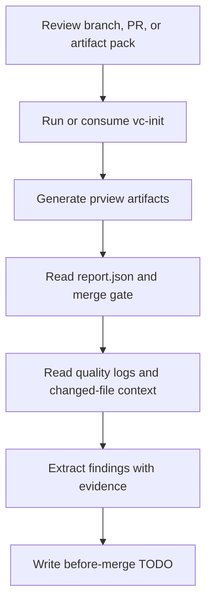

# `vc-prview` Flow

## Flow

## Routes

| Entry                             | Args         | Produces          | Exit            |
| --------------------------------- | ------------ | ----------------- | --------------- |
| `prview --pr <n>`                 | PR number    | artifact pack     | review evidence |
| `prview --with-tests --with-lint` | branch scope | quality artifacts | merge gate      |
| `vc-prview <agent>`               | prompt/file  | findings report   | bounded audit   |
