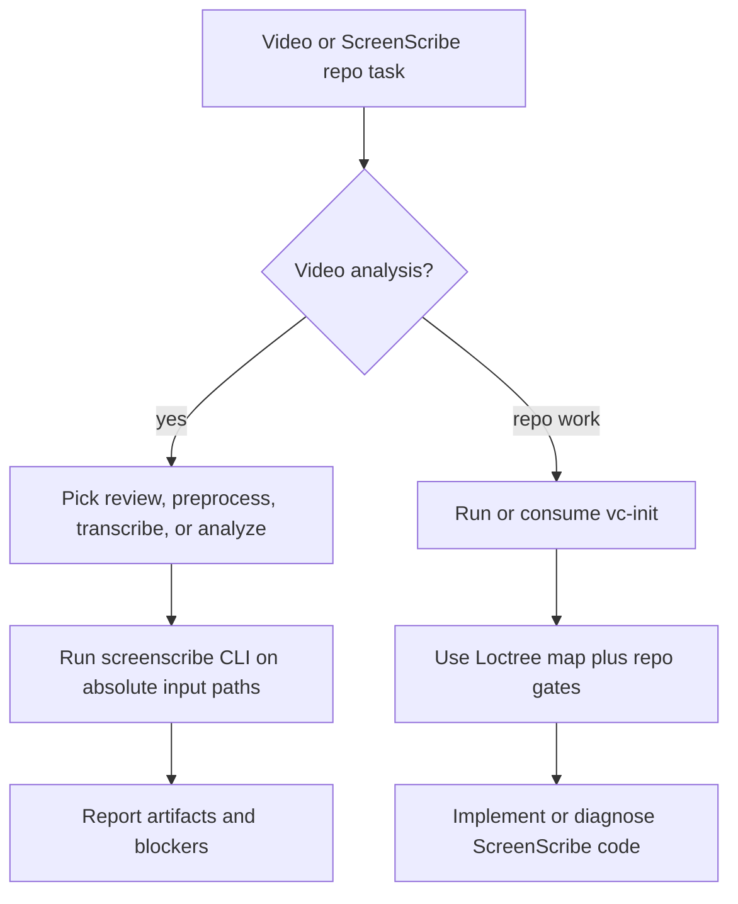

# `vc-screenscribe` Flow

## Flow

## Routes

| Entry                     | Args              | Produces                               | Exit          |
| ------------------------- | ----------------- | -------------------------------------- | ------------- |
| `screenscribe review`     | video paths       | transcript, findings, report artifacts | review output |
| `screenscribe preprocess` | video path        | transcript-first bundle                | artifact pack |
| `vc-screenscribe`         | repo/debug prompt | repo-aware guidance                    | report        |
