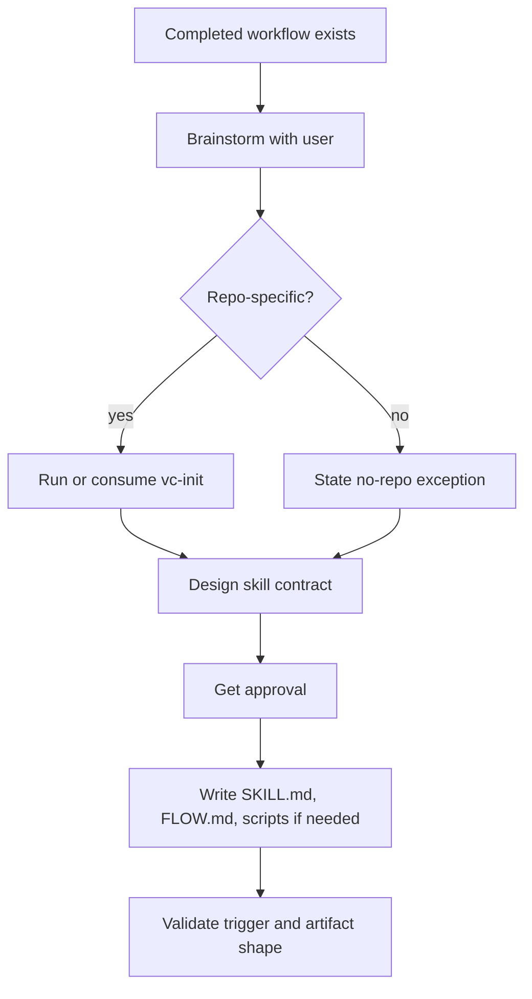

# `vc-skillaunch` Flow

## Flow

## Routes

| Entry           | Args                       | Produces               | Exit                  |
| --------------- | -------------------------- | ---------------------- | --------------------- |
| `vc-skillaunch` | completed workflow context | reusable skill package | installed skill draft |
