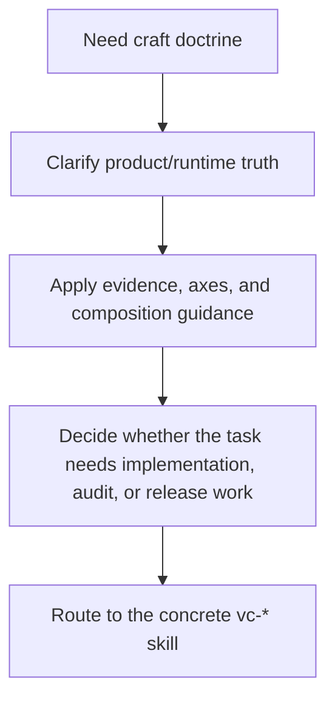

# `vibecraftsmanship` Flow

## Flow

## Routes

| Entry               | Args                              | Produces                   | Exit             |
| ------------------- | --------------------------------- | -------------------------- | ---------------- |
| `vibecraftsmanship` | conceptual/product-quality prompt | doctrine-grounded guidance | routed next move |
